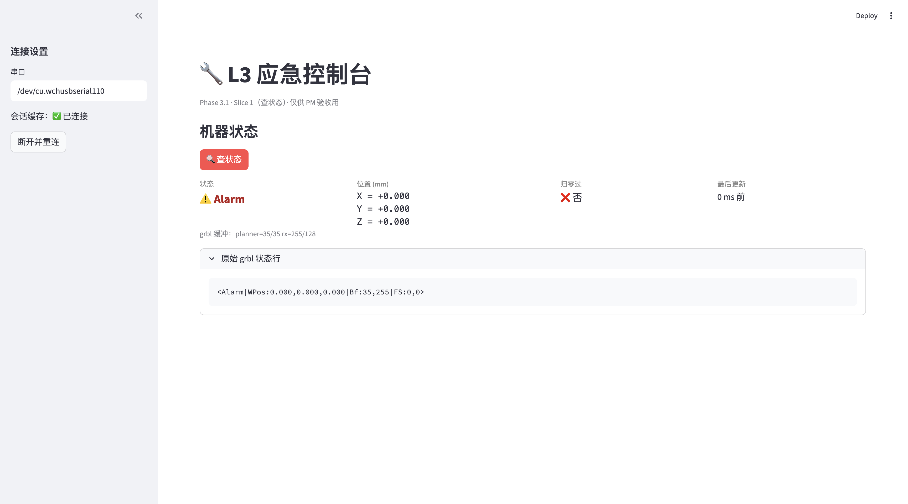
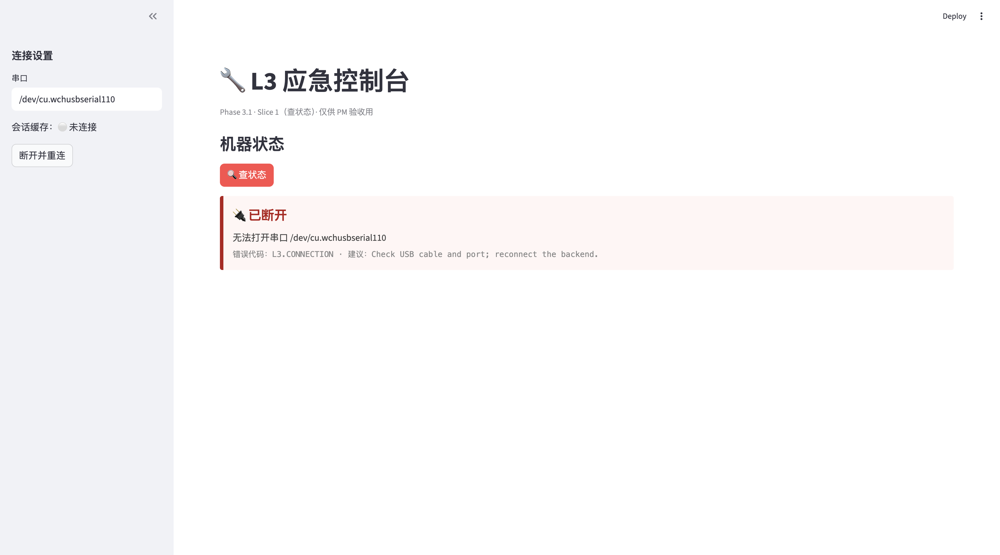

# Slice 1 验收：查状态按钮

## 元信息

- **日期**：2026-04-20
- **关联**：[phase-3.1-plan.md §Slice 1](../decision-log/phase-3.1-plan.md)
- **PM 签字**：✅ Kevin / 2026-04-20 20:24

## 一句话目标

PM 在浏览器点「🔍 查状态」按钮，500ms 内看到机器状态卡片；USB 拔掉时显示
红色「已断开」，不是 Python 栈追踪。

## 验收清单

| # | 验收项 | 结果 | 截图 |
|---|---|---|---|
| 0 | 前置准备：`localhost:8501` 打开看到空白 dashboard | ✅ | [前置](#0-前置准备) |
| 1 | 「🔍 查状态」按钮存在 | ✅ | [① 已连接](#1-已连接状态) |
| 2 | 点一下，500ms 内出结果 | ✅ | ① |
| 3 | 状态/位置/是否归零/最后更新 4 列正确 | ✅ | ① |
| 4 | grbl 原始状态行可展开复核 | ✅ | ① |
| 5 | 拔 USB 后显示红色「已断开」卡片 | ✅ | [② 已断开](#2-已断开状态) |
| 6 | 错误信息不是 Python 栈追踪 | ✅ | ② |

## 关键截图

### 0. 前置准备

`streamlit run tools/ui/emergency_dashboard.py` 打开后的空白页，标题 + 蓝色
提示框。证明 Streamlit 装好、`src/` 骨架可被 import。

### ① 已连接状态

机器上电自动进 `Alarm`（grbl `$22=1` 配置：未归零前禁止运动）。位置全 0
是因为还没归零；归零过 ❌ 否；最后更新 0 ms 前。grbl 原始状态行
`<Alarm|WPos:0.000,0.000,0.000|Bf:35,255|FS:0,0>` 可被解析。

### ② 已断开状态

USB 未插时点查状态，得到红色「🔌 已断开」+ `L3.CONNECTION` 错误码 +
中文 `human_message` + 英文 `suggested_action`。无 Python 栈追踪。
Sidebar「会话缓存」自动变为「未连接」（backend 已被丢弃）。

## 已发现 + 已处理的问题

- **rx 缓冲显示 `255/128` cosmetic bug** —— 我硬编码了 Arduino Uno 的 128B
  上限，实际 grbl-Mega-5X 在 Mega 2560 上是 256B。已修为 `255/256`，且
  Slice 2 的 bCNC 流控也用 `RX_BUFFER_SIZE=256`。

## 给后续 tutorial 的 hook

- "为什么 Alarm 是 grbl 的默认上电状态" → tutorial 写 `$22` 配置含义和
  `$X` 解锁 vs `$H` 归零的关系
- "状态字段从哪来" → tutorial 解释 grbl `?` 报告的 `WPos`/`MPos`/`Bf`
  字段，以及 `STATUS_REGEX` 怎么 parse
