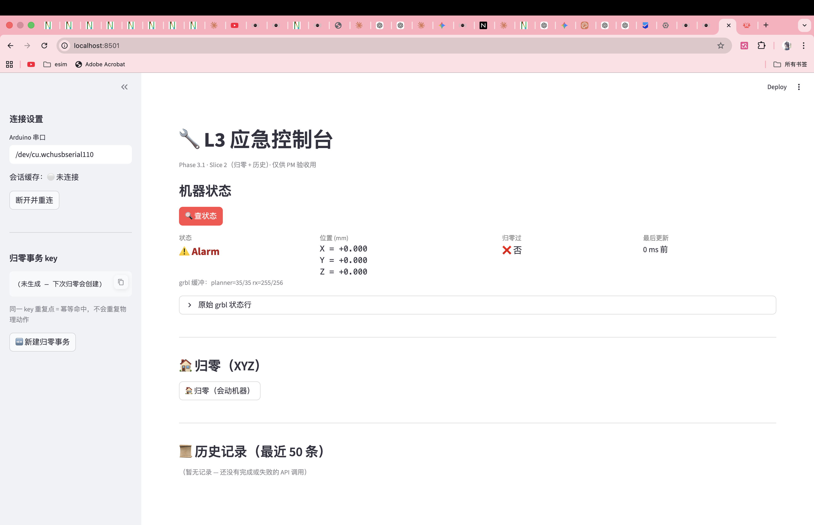
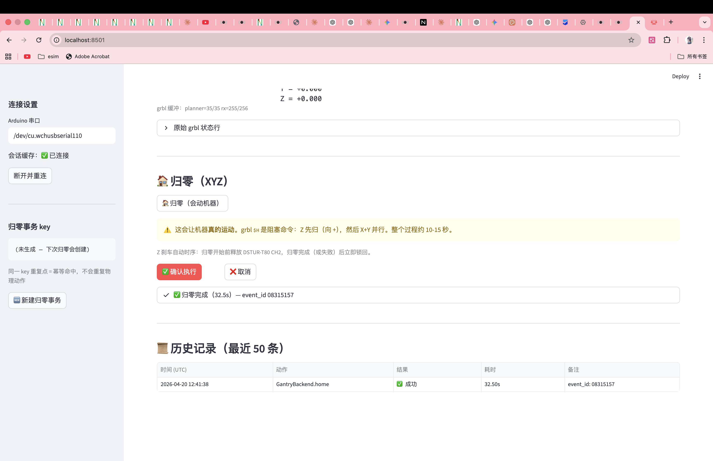
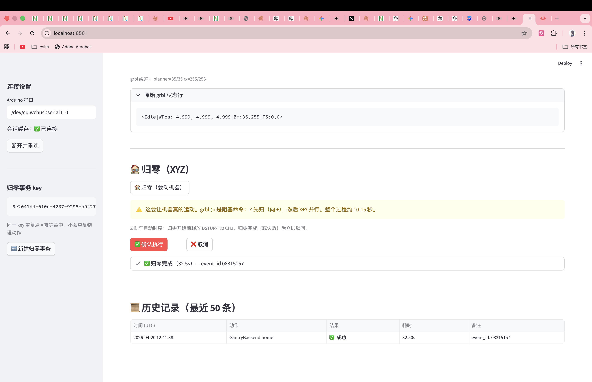
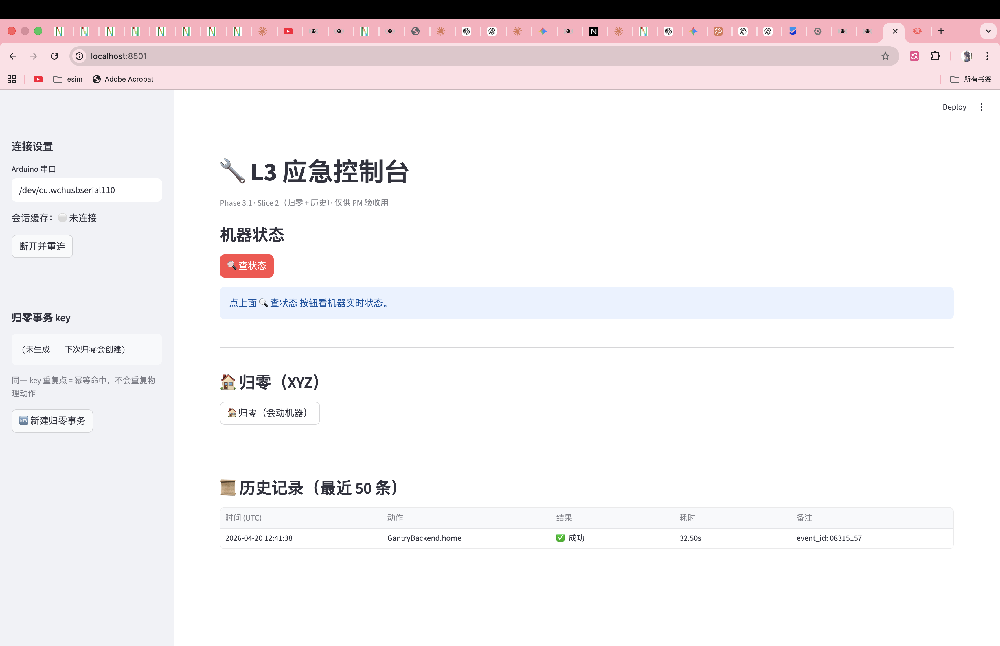
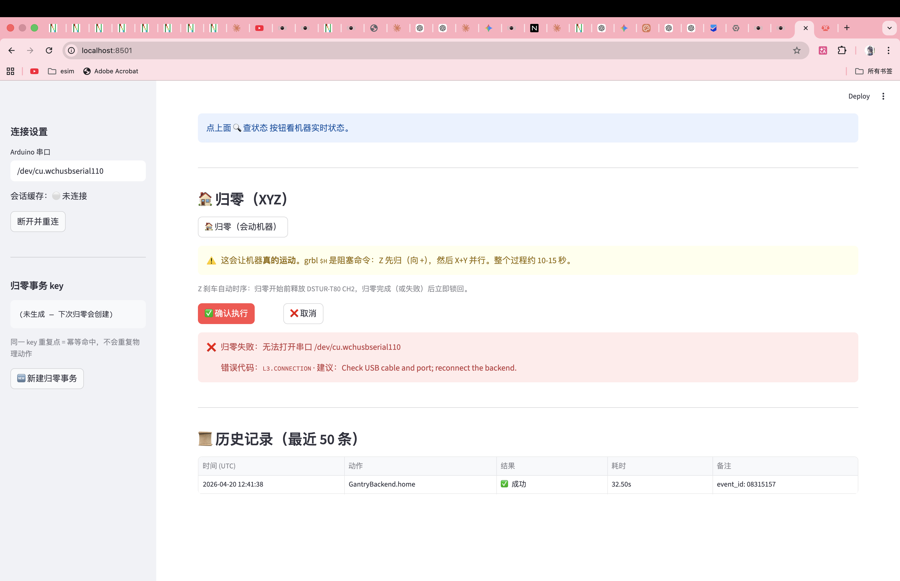

# Slice 2 验收：归零按钮 + 历史记录

## 元信息

- **日期**：2026-04-20
- **关联**：[phase-3.1-plan.md §Slice 2](../decision-log/phase-3.1-plan.md)
- **PM 签字**：✅ Kevin / 2026-04-20 20:44

## 一句话目标

PM 点「🏠 归零」按钮，机器**真的动**（Z 先归 → X/Y 并行），完成后历史
表格新增一行；同 idem key 重复点不重复执行；刷新页面历史还在；拔 USB
时显示中文错误而非栈追踪。

## 验收清单

| # | 验收项 | 结果 | 截图 |
|---|---|---|---|
| A | Slice 2 入口完整：归零按钮 + 空历史表 | ✅ | [① 初始](#1-slice-2-初始状态) |
| 1 | 点归零 + ✅ 确认执行，机器真的动（Z 先 → X/Y） | ✅ | [② 归零成功](#2-归零成功) |
| 2 | `st.status` 进度框跟着变成「✅ 归零完成」 | ✅ | ② |
| 3 | 完成后历史表格出现 1 行（动作=`GantryBackend.home`） | ✅ | ② |
| 4 | 状态卡片自动刷新成 `Idle` + 归零过 ✅ 是 + Z 在 -4.999（pull-off 后） | ✅ | [③ 幂等命中](#3-幂等命中) |
| B | 同一 idem key 再点归零，机器**不动**、瞬间完成 | ✅ | ③ |
| B | 历史表**不增加**新行 | ✅ | ③ |
| C | 整页刷新（Cmd-R），历史那 1 行还在（SQLite 持久） | ✅ | [④ 刷新后持久](#4-刷新后历史依然在) |
| D | 拔 Arduino USB → 点归零 → 红色 `st.error`，含 `L3.CONNECTION` | ✅ | [⑤ USB 拔掉错误](#5-usb-拔掉时归零失败) |
| D | 错误**不是** Python 栈追踪 | ✅ | ⑤ |

## 关键截图

### ① Slice 2 初始状态

新增「🏠 归零（XYZ）」板块 + 「📜 历史记录」板块（暂无记录）。状态卡片
仍是 Slice 1 那套，sidebar 多了「归零事务 key」。

### ② 归零成功

点 ✅ 确认执行后：`st.status` 展开显示「事务 key abab389b...」+「步骤：释放
Z 刹车 → 发 $H → 等 ok → 锁回 Z 刹车」。32.5s 后变成绿色「✅ 归零完成
（32.5s）— event_id 08315157」。历史表同步新增一行：
`GantryBackend.home / ✅ 成功 / 32.50s / event_id: 08315157`。

实际机械动作：Z 轴先向上撞限位再 pull-off 到 -4.999 → X/Y 并行归零 →
全部完成后 Z 刹车锁回。

### ③ 幂等命中

注意：
- sidebar「归零事务 key」显示 `6e2041dd-010d-4237-9258-b9427...`（同一把 key）
- grbl 原始状态行：`<Idle|WPos:-4.999,-4.999,-4.999|Bf:35,255|FS:0,0>` —— 机器在 Idle
- 归零按钮再点过一次后，`st.status` 仍是「✅ 归零完成（32.5s）— event_id 08315157」
  （**event_id 与第一次完全相同**，证明是缓存返回）
- 历史表**还是只有一行**（@observable 的 idem cache 命中时不 record）

### ④ 刷新后历史依然在

Sidebar 的 idem key 显示「(未生成 — 下次归零会创建)」—— 因为 session_state
是浏览器会话级，刷新会丢；但 SQLite 是文件级（`runtime/runlog.db`），
所以历史表那一行成功记录还在。

### ⑤ USB 拔掉时归零失败

PM 先点 sidebar「🆕 新建归零事务」清掉缓存的 idem key（否则 cache hit
会假装成功掩盖错误），然后拔 Arduino USB，再点归零。结果：红色 `st.error`
显示「❌ 归零失败：无法打开串口 /dev/cu.wchusbserial110 / 错误代码：
L3.CONNECTION / 建议：Check USB cable and port; reconnect the backend.」
完全没有 Python 栈追踪。

## 已发现 + 已处理的问题

- **Streamlit 模块缓存导致 AttributeError** —— 我加了 `home()` 方法到
  `GantryBackend` 后，浏览器刷新时 dashboard 仍报 `'GantryBackend' object
  has no attribute 'home'`。原因：Streamlit 的热重载只重跑入口脚本，不
  重新 import `src/*` 子模块；session_state 里又持有旧 class 的实例。
  **解决**：手动重启 streamlit 进程。
  **后续**：重启时改用 `--server.runOnSave=true` —— dashboard 改动会
  自动 rerun，但 src/* 改动仍需手动重启。Slice 3 起若频繁改 backend，
  建议直接 kill + restart。

## 给后续 tutorial 的 hook

- "幂等性怎么实现" → tutorial 展开 `@observable` 装饰器、`_IDEM_CACHE`、
  TTL，以及为什么 Agent 重试不需要担心副作用叠加
- "Z 刹车时序为什么这么写" → tutorial 展开 DSTUR-T80 协议（`0xA0 [CH]
  [STATE] [checksum]`）+ 为什么 grbl `$1=255` 让电机常通电后 Z 刹车
  释放期间不掉
- "bCNC char-counting 流控" → tutorial 展开 cline/sline 算法、为什么
  `RX_BUFFER_SIZE=256`（Mega 不是 Uno）、Slice 3 多命令场景下背压怎么走
- "runlog 表结构" → tutorial 给完整 schema + 查询样例
