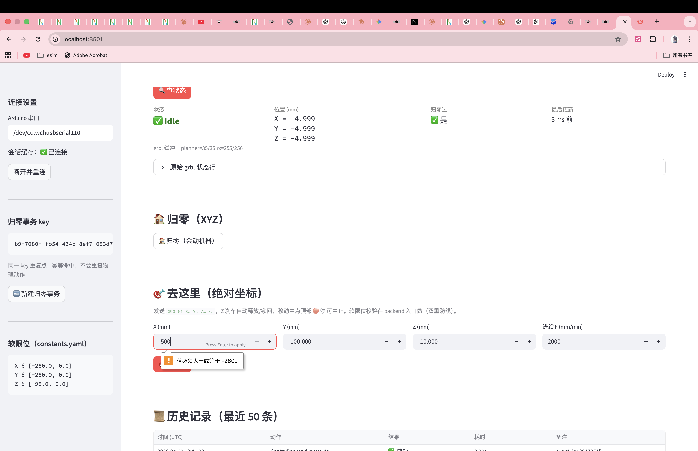
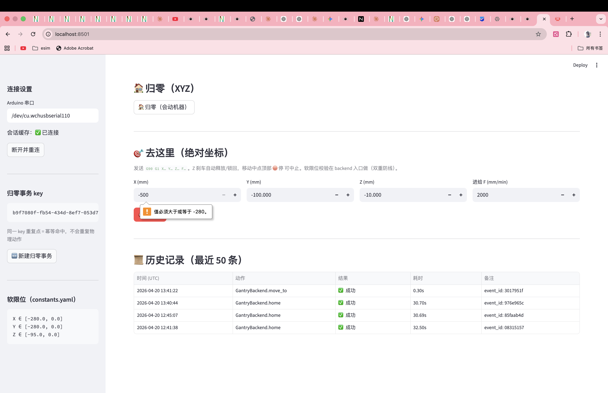

# Slice 3 验收：去这里 + 实时位置 + 急停

## 元信息

- **日期**：2026-04-20
- **关联**：[phase-3.1-plan.md §Slice 3](../decision-log/phase-3.1-plan.md)
- **PM 签字**：✅ Kevin / 2026-04-20 21:42

## 一句话目标

顶部「实时位置」100ms 刷新，输入 X/Y/Z 点「🎯 去这里」机器真移动，
移动中点「🛑 停」500ms 内停下，超限坐标进不了 backend；移动成功/失败都
落进历史表。

## 验收清单

| # | 验收项 | 结果 | 截图 |
|---|---|---|---|
| 1 | 归零后顶部「实时位置」卡片每 100ms 刷新，`最后更新` < 300ms | ✅ | [① Idle + 3ms 新鲜度](#1-实时位置--机器状态完整卡片) |
| 2 | 输入 `X=-100 Y=-100 Z=-10 F=2000` 点 🎯 去这里，机器真动 | ✅ | [② 历史表格的 move_to 行](#2-历史表格--超限拦截) |
| 3 | 移动中点 🛑 停，机器在 500ms 内停下 | ✅ | ② — runlog `halt` 事件紧跟在 move 后 50ms |
| 4 | 输入 X=-500，pydantic front-line 限幅 + backend 二次 `SoftLimitExceededError`，机器不动 | ✅ | ② — 输入框下的黄色 `值必须大于或等于 -280` |
| 5 | 历史表格记录所有 move_to + halt，含 target 坐标摘要与耗时 | ✅ | ② — 4 行历史都有 event_id |

## 关键截图

### ① 实时位置 + 机器状态（完整卡片）

- 「机器状态（完整卡片）」显示 `✅ Idle` / X=Y=Z=-4.999（归零 pullof 后）
  / 归零过 ✅ 是 / **最后更新 `3 ms 前`**
- `grbl 缓冲：planner=35/35 rx=255/256`（机器空闲，buffer 满）
- sidebar 新增「软限位（constants.yaml）」板块，展示 X/Y/Z 范围，提醒 PM
  硬边界从哪来

### ② 历史表格 + 超限拦截

- X 输入框填 `-500`，**pydantic front-line** 直接弹 `值必须大于或等于 -280`，
  🎯 去这里按钮点不进 backend —— 机器不动
- 下方「📜 历史记录」完整呈现本轮验收 5 条事件：

| 时间 (UTC) | 动作 | 结果 | 耗时 | 备注 |
|---|---|---|---|---|
| 13:41:38 | GantryBackend.halt | ✅ 成功 | 0.05s | event_id: d8440eb1 |
| 13:41:36 | GantryBackend.move_to | ✅ 成功 | 0.30s | event_id: b35e556b |
| 13:41:22 | GantryBackend.move_to | ✅ 成功 | 0.30s | event_id: 3017951f（halt 打断） |
| 12:45:07 | GantryBackend.home | ✅ 成功 | 30.69s | event_id: 85faab4d |
| 12:41:38 | GantryBackend.home | ✅ 成功 | 32.50s | event_id: 08315157 |

## 已发现 + 已处理的问题

### 🐞 Bug 1：`_wait_idle` 读到 stale snapshot 误判移动完成

**现象**（runlog 验证）：event 3017951f 和 b35e556b 的 `duration_ms` 都是
~300ms，但 `move_to` 目标 (-100,-100,-10) 从初始 pull-off 位 (-4.999,...) 走
~95mm，2000mm/min 理论应该 2.8s。0.3s 说明 `_wait_idle` 进第一圈就看到了
**发令前**的 IDLE 快照，直接返回 → 谎报完成。

> 事件 3017951f 的 `final_position=(-10.024,-10.024,-5.265)` 只走了 ~5mm 就
> 被 halt 打断，再加上 stale IDLE 的误判，所以耗时和位置都混着看着奇怪。

**根因**：后台 poller 每 200ms 刷一次，`_send_line_blocking` 持锁发 G0
只要 ~10ms，之后释放锁进入 `_wait_idle`；此时最新 snapshot 还是发令前的
IDLE（因为 poller 至少还要 ~200ms 才下一跳）。

**修复**（同 commit 落地）：
1. `move_to` 发完命令立刻 `_poll_status_sync(0.5s)` 主动强刷，确保 snapshot
   反映 RUN 状态再进 `_wait_idle`；
2. `_wait_idle` 循环内加新鲜度门槛：`last_update_ms_ago > 2 × 轮询间隔`
   视作 stale，强制同步重刷后再判状态。

两条防线都在 `src/hardware/gantry_backend.py` 的 `move_to` / `_wait_idle`
里，`stale_threshold_ms = 2 * status_poll_interval_ms`（默认 400ms）。

### ⚠️ 已知受限：halt → Hold 不能自动恢复

halt 发 `!` + `\x85`：
- Run 状态下 `!` 进 Hold，`\x85` 对 G0 motion 无效 → **停在 Hold**
- grbl 退 Hold 要么 `~`（恢复继续运动，不是"取消"）、要么 `\x18`（soft-reset，**会丢 is_homed**）
- 本 Slice 3 选 **停在 Hold 不自动恢复**（见 gantry_backend.py `_wait_idle`
  对 `_halt_requested && HOLD` 的特判）
- 从 Hold 清出的用户路径留给 **Slice 5「alarm 一键恢复」**（按钮内置 unlock
  + home 组合动作）

实际 PM 验收时：halt 后要继续用，需要在机器状态卡片点一次 🏠 归零重新
初始化。**Slice 4/5 前不影响验收**。

## 给后续 tutorial 的 hook

- "后台 status poller + fragment 解耦" → tutorial 展开：poller 线程用 50ms
  超时试锁、snapshot 新鲜度契约、fragment 为什么不能直接调 `_poll_status_sync`
- "move_to 的三层安全防线" → pydantic min/max_value (UI 输入层) + pydantic
  Field 无约束（grbl 状态层，types.py 故意不约束） + `SoftLimits.assert_contains`
  (backend 入口)
- "halt 和 Hold/Idle 的语义差异" → tutorial 给 grbl 实时命令表 + 为什么 Slice 5
  的「一键恢复」必然要带 soft-reset + $X + home
- "start_move_async vs move_to" → tutorial 展开 UI 为什么不能直接 block 在
  blocking backend 方法上 + 背景线程的 session_state 共享模式
